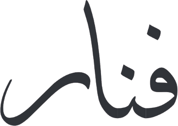
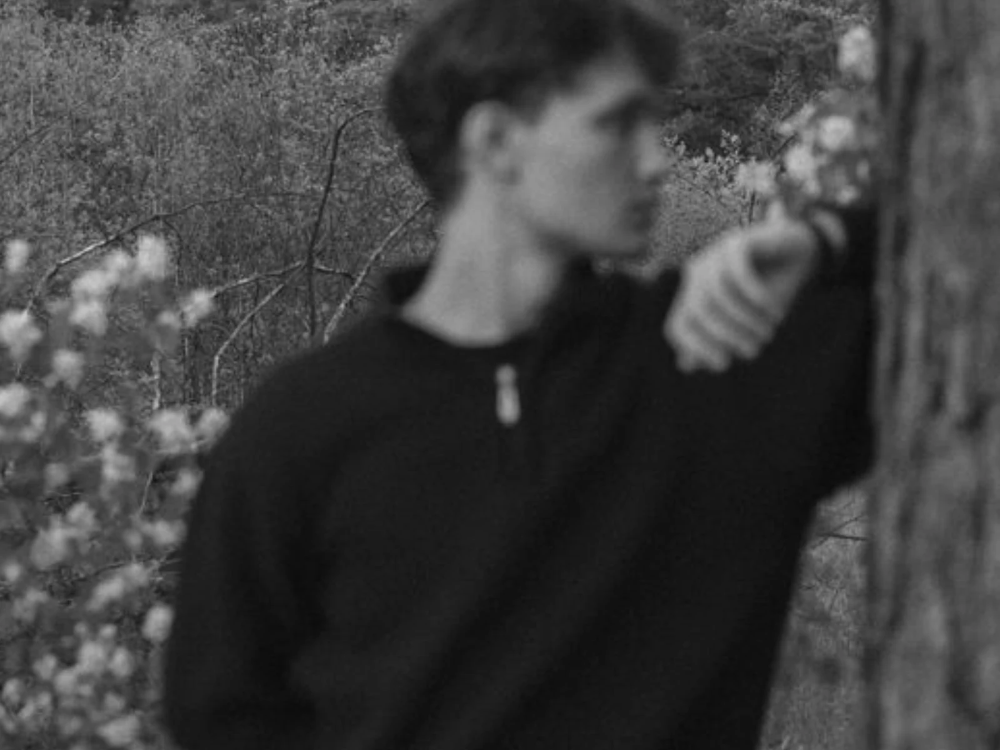

  <picture>
    <source media="(prefers-color-scheme: dark)" srcset="docs/readme/logo-light.png">
    
  </picture>

<em>The science of apparel</em>

  

  Fanaar is a menswear label established in Faisalabad, Pakistan. Every piece is knitted and finished
  in our own facility: drop needle ribs, micro-block textures and waffle thermals, engineered at the
  yarn rather than printed on the surface. Sophisticated yet comfortable, made in small runs.

  <a href="https://www.shopfanaar.com">shopfanaar.com</a> ·
  <a href="https://www.instagram.com/fanaarpakistan/">Instagram</a> ·
  <a href="https://www.pinterest.com/fanaarpakistan/">Pinterest</a>

